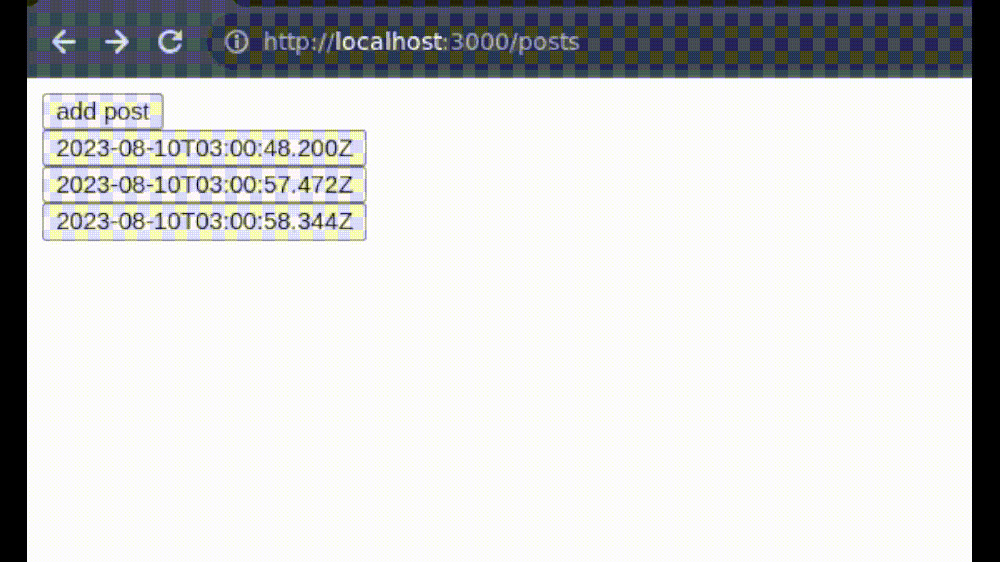

# NextJs app dir realtime issue reproduction

1. Render server component
2. Child client component updates server rendered results
3. Navigate away
4. Navigate back

* Expected: List to have updated results
* Actual: List has stale results

## Usage

* set supabase environment vars in `.env.local`
* Set up tables: `npx supabase migration up`
* Start app: `yarn && yarn dev`
